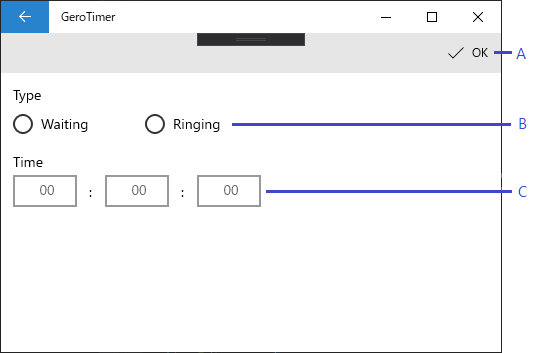

# Edit Item Window

## UI Item Names

|Mark|Name|
|:--:|:---|
|A|OK Button|
|B|Item Type Radio Button|
|C|Item Time Text Boxes|

## UI Item Descriptions

### OK Button

This button is always visible.

This button is disable when ...

* None of the radio button choices are selected
* The time specified in the item time text boxes is 0 hours 0 minutes 0 seconds

### Item Type Radio Button

This button is always visible and enable.

Initially nothing is selected.

### Item Time Text Boxes

These text boxes are always visible and enable.

Initially these text boxes specify 0 hours 0 minutes 0 seconds.

Users can enter only numeric characters that is up to 2 digits in each of these text boxes.
And every text box is always not be empty.

Each text box has limits of the number.
The minimum number of all text boxes of item time text boxes is 0, and the maximum number is depend on each text box.

* the maximum number of hours is 99
* the maximum number of minutes is 59
* the maximum number of seconds is 59

If the user tries to edit against the above conditions, the value in the text box is not change.

