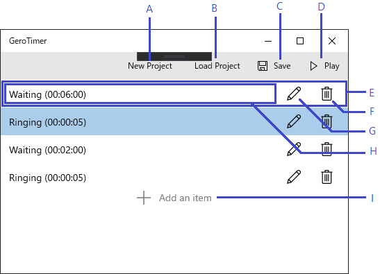

# Main Window

## UI Item Names

|Mark|Name|
|:--:|:---|
|A|New Project Button|
|B|Load Project Button|
|C|Save Project Button|
|D|Play Sequence Button|
|E|Sequence Item|
|F|Delete Item Button|
|G|Edit Item Button|
|H|Sequence Item Summary|
|I|Add New Item Button|

## UI Item Descriptions

### New Project Button

This button is always visible and enable.

### Load Project Button

This button is always visible and enable.

### Save Project Button

This button is always visible.

This button is disable when ...

* The current project does not yet exist

### Play Sequence Button

This button is always visible.

This button is disable when ...

* The current project does not yet exist
* There are no sequence items

### Sequence Item

A sequence item contains a sequence item summary area, an edit item button and a delete item button.
Sequence items are listed in order of execution.
If there are more sequence items than can show in the window height, you can scroll through the list to see the hidden items.

This area is invisible when ...

* The current project does not yet exist

#### Delete Item Button

This button is always visible whenever that the sequence item which contains this button exists.

This button is always enable.

#### Edit Item Button

This button is always visible whenever that the sequence item which contains this button exists.

This button is always enable.

#### Sequence Item Summary

A sequence item summary is shown in the sequence item.
The UI specification of this area is depend on the sequence item type.

This area is always visible whenever that the sequence item which contains this area exists.

### Add New Item Button

The add new item button is placed at the bottom of the list of sequence items.
This button scrolls with the list of sequence items.

This button is invisible when ...

* The current project does not yet exist

This button is always enable.
