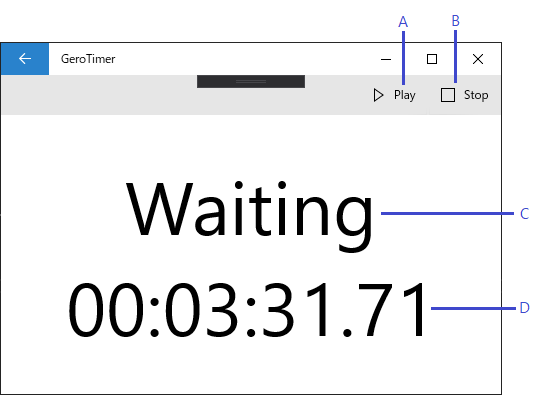

# Play Window

## UI Item Names

|Mark|Name|
|:--:|:---|
|A|Play Button|
|B|Stop Button|
|C|Item Name|
|D|Remain Time|

## UI Item Descriptions

### Play Button

This button is always visible.

This button is disable when ...

* The sequence is being executed

### Stop Button

This button is always visible.

This button is disable when ...

* The sequence is not being executed

### Item Name

This area is always visible.

### Remain Time

This area is always visible.

The time format is "hh:mm:ss.ff".
