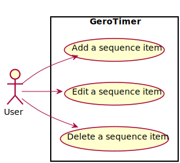

# Sub Use Cases

There are below sub use cases in the use case "Edit alarm sequence".

* [Add a sequence item](AddASequenceItem/AddASequenceItem.md)
* [Edit a sequence item](EditASequenceItem/EditASequenceItem.md)
* [Delete a sequence item](DeleteASequenceItem/DeleteASequenceItem.md)
